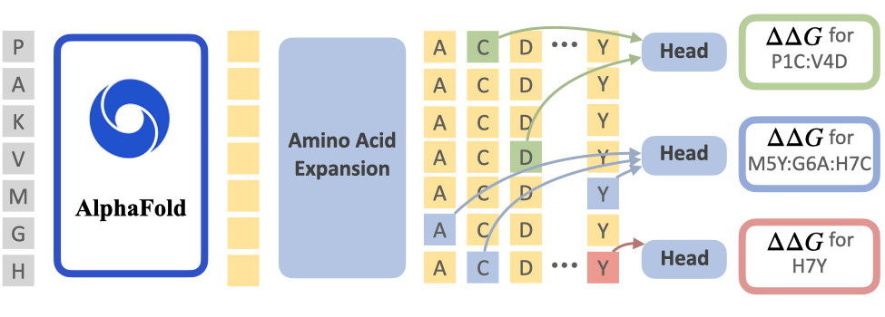

# Mutate Everything

By [Jeffrey Ouyang-Zhang](https://jozhang97.github.io/),  [Daniel J. Diaz](http://danny305.github.io), [Adam Klivans](https://www.cs.utexas.edu/users/klivans/), [Philipp Krähenbühl](http://www.philkr.net/)

This repository is an official implementation of the paper [Predicting a Protein’s Stability under a Million Mutations](https://arxiv.org/abs/2310.12979).

**TL; DR.** parallel decode thermodynamic stability of a protein under single and double mutations


## Main Results

| Method | Backbone | S669 Spearman | cDNA2 nDCG | Total Train time (GPU hours) | URL |
|---------------------------|:--------:|:------:|:------------------------------------:|:------------------------------:|-----------------------------------------------------------------------------------------------------------------------------------------------------------------------------------------------------------------------------------------|
| Mutate Everything | ESM2      | 0.47 | 0.38 | 3 | [log1/2](https://drive.google.com/file/d/1s2OOuJ1wVrKoy8zI8Oyh11ouEzt-Nq1o/view?usp=share_link) [log2/2](https://drive.google.com/file/d/1fR1OYP95nMq2TlquCwTzmOFVGvGE8QYQ/view?usp=sharing) [model](https://utexas.box.com/s/giodqufy5idqfv3apgbxtevfd8q7nytw) |
| Mutate Everything | AlphaFold | 0.56 | 0.47 | 24 | [log1/2](https://drive.google.com/file/d/1UN6vP-fkgpvBua_4J4OWoU6uWQy8d3Zf/view?usp=sharing) [log2/2](https://drive.google.com/file/d/1O8DsRFgJ5hh93Ua4W8gj_M_AFvLkGfLS/view?usp=sharing) [model](https://utexas.box.com/s/xr2dka1oiykysr8dpxw159w650k97s01) |

## Data
cDNA,ProTherm Multiple,s669 are available [here](https://drive.google.com/drive/folders/1psp5LBnAWpwkzGtsWD9SJgauo8xX_eaK?usp=sharing). It can also be prepared:
```
pip install gdown
gdown 1cn69cNCOIOmBSDYm5hTrdN0Ioozr7nVc
unzip mutate_everything_data
mv mutate_everything_data data
```

Place in `./data`. The data should be organized as follows:

```
data/
    s669/
        mutations/
            s669.csv
        fasta/
            1A0FA/
                1A0FA.fasta
            ...
        msa/
            1A0FA/
                1A0FA.a3m
            ...
```


## Installation

We prepare the conda environment to run our code below:
```
git clone https://github.com/jozhang97/MutateEverything
cd MutateEverything

conda env create --name=mutate_everything -f environment.yml
source activate mutate_everything

git clone https://github.com/HazyResearch/flash-attention
cd flash-attention
git checkout 5b838a8bef
python3 setup.py install
cd ..

cd openfold
python setup.py install
cd ..
```
Installation tested with torch1.12.1+cuda11.3 on A100,A40,RTX6000. We fork openfold from checkout `b5fa2ba` with minor changes.

## Usage

### Evaluation

You can evaluate our pretrained Mutate Everything models. Replace 1gl5 with your target protein.

For ESM, install the model [here](https://utexas.box.com/s/giodqufy5idqfv3apgbxtevfd8q7nytw) and place at `models/mutate_everything_esm.pth`. Then run:
```bash
python test.py \
    --backbone esm2_t33_650M_UR50D \
    --resume models/mutate_everything_esm.pth \
    --output_dir example/1gl5_esm \
    --name 1gl5 \
    --seq example/1gl5.fasta
```

For AlphaFold, first prepare the MSA for your sequence. For example, you can use [Colabfold](https://colab.research.google.com/github/sokrypton/ColabFold/blob/main/batch/AlphaFold2_batch.ipynb) to do so. Install the model [here](https://utexas.box.com/s/xr2dka1oiykysr8dpxw159w650k97s01) and place at `models/mutate_everything_af.pth`. Then run:
```bash
python test.py \
    --backbone af \
    --resume models/mutate_everything_af.pth \
    --output_dir example/1gl5_af \
    --name 1gl5 \
    --seq example/1gl5.fasta \
    --msa_dir example/1gl5_msa
```

### Training
To train Mutate Everything with ESM backbone on 3 GPUs. Training has two steps: first train the single mutation model, then train the double mutation model.
```bash
torchrun --nproc_per_node=3 main_train.py \
    --batch_size 1 \
    --data_path data/cdna/mutations/cdna_train.csv \
    --eval_data_paths data/s669/mutations/s669.csv \
    --dist_eval \
    --backbone esm2_t33_650M_UR50D \
    --freeze_at 14 \
    --lambda_double 0. --lambda_single 1. \
    --eval_period 999 --epochs 20 --warmup_epochs 2 --save_period 20 \
    --disable_wandb \
    --output_dir logs/esm_single

torchrun --nproc_per_node=3 main_train.py \
    --batch_size 1 \
    --data_path data/cdna/mutations/cdna_train.csv \
    --eval_data_paths data/cdna/mutations/cdna2_test.csv,data/s669/mutations/s669.csv,data/protherm/mutations/protherm_multiple.csv \
    --dist_eval \
    --backbone esm2_t33_650M_UR50D \
    --freeze_at 14 \
    --eval_period 1000 --epochs 100 --warmup_epochs 10 --save_period 100 \
    --finetune logs/esm_single/checkpoint-19.pth \
    --disable_wandb \
    --output_dir logs/esm_double
```

Download pre-trained Alphafold from Openfold and place at `models/finetuning_ptm_2.pt`:
```bash
pip install awscli
aws s3 cp --no-sign-request --region us-east-1 s3://openfold/openfold_params/ ./models --recursive
```
To train Mutate Everything with AlphaFold backbone on 3 GPUs:
```bash
torchrun --nproc_per_node=3 main_train.py \
    --batch_size 1 \
    --finetune_backbone models/finetuning_ptm_2.pt \
    --data_path data/cdna/mutations/cdna_train.csv \
    --eval_data_paths data/s669/mutations/s669.csv \
    --dist_eval \
    --backbone af \
    --lambda_double 0. --lambda_single 1. \
    --eval_period 999 --epochs 20 --warmup_epochs 2 --save_period 20 \
    --disable_wandb \
    --output_dir logs/af_single

torchrun --nproc_per_node=3 main_train.py \
    --batch_size 1 \
    --finetune_backbone models/finetuning_ptm_2.pt \
    --data_path data/cdna/mutations/cdna_train.csv \
    --eval_data_paths data/cdna/mutations/cdna2_test.csv,data/s669/mutations/s669.csv,data/protherm/mutations/protherm_multiple.csv \
    --dist_eval \
    --backbone af \
    --eval_period 1000 --epochs 100 --warmup_epochs 10 --save_period 100 \
    --finetune logs/af_single/checkpoint-19.pth \
    --disable_wandb \
    --output_dir logs/af_double
```

## License

This project builds heavily off of [MAE](https://github.com/facebookresearch/mae) and extensively uses [OpenFold](https://github.com/aqlaboratory/openfold/). Please refer to their original licenses for more details.

## Disclaimer
We observe a cysteine stabilization bias when examining DMS predictions (cysteine is often predicted to be the most stabilizing substitution). We are unsure if this is an artifact from the training data but attempts to fix this bias lead to worse metrics on the test set. Use cysteine predictions with caution.

## Citing Mutate Everything
If you find Mutate Everything useful in your research, please consider citing:

```bibtex
@article{ouyangzhang2023predicting,
  title={Predicting a Protein’s Stability under a Million Mutations},
  author={Ouyang-Zhang, Jeffrey and Diaz, Daniel J and Klivans, Adam and Kr{\"a}henb{\"u}hl, Philipp},
  journal={NeurIPS},
  year={2023}
}
```
